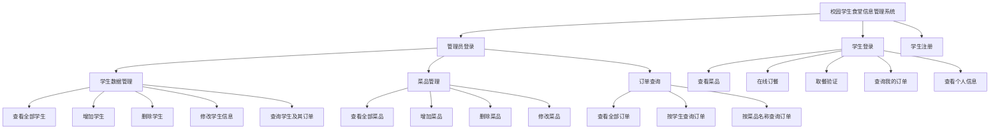
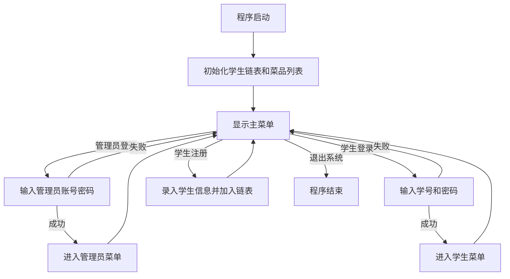
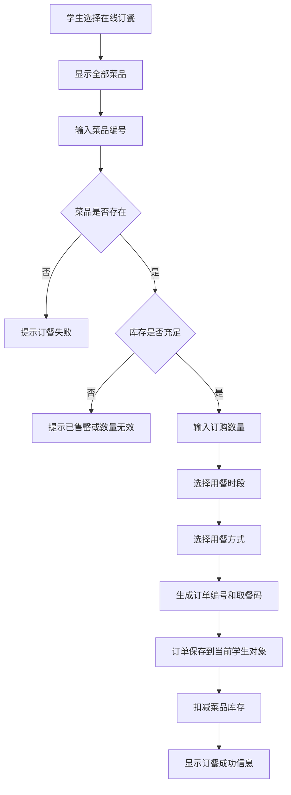
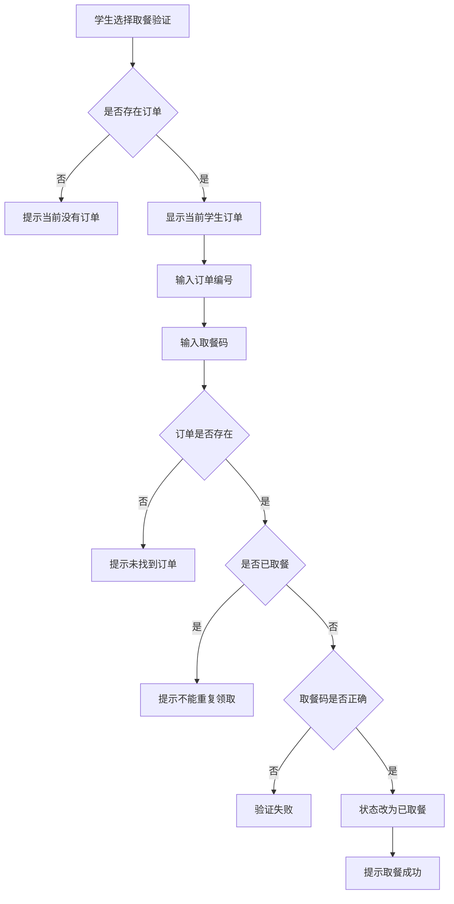

# 校园学生食堂信息管理系统

> 2026 年春季学期编程实践课程 · 题目 1 阶段汇报总结  
> 项目类型：C++ 控制台程序 / 面向对象程序设计 / 学生类链表  
> 当前版本：题目 1 简化规范版

---

## 1. 项目简介

本项目是一个面向校园食堂场景的学生食堂信息管理系统，主要用于模拟学生查看菜品、在线订餐、取餐验证，以及管理员管理学生、菜品和订单信息的完整业务流程。

系统采用 C++ 语言实现，使用“学生类链表”管理学生信息，使用 `vector<Dish>` 管理菜品信息，并将订单记录保存在对应学生对象内部。程序重点体现面向对象程序设计思想：管理员作为超级用户，主要通过全局函数完成系统层面的数据管理；学生登录后，则通过学生对象指针调用自身成员函数完成查看菜单、订餐、取餐和查询订单等操作。

本阶段系统聚焦题目 1 的核心要求，完成了用户管理、菜品管理、订餐与取餐等基本功能，并为题目 2 的支付结算、数据统计、评价反馈、文件读写等扩展功能预留了清晰的结构基础。

---

## 2. 项目目标

本项目的主要目标如下：

1. 使用学生类链表保存和管理学生信息，体现链表的插入、删除、查找和遍历操作。
2. 区分管理员和学生两类用户，实现不同角色下的不同操作权限。
3. 管理员通过全局函数完成学生数据管理、菜品管理和订单综合查询。
4. 学生通过自身对象的成员函数完成查看菜品、在线订餐、取餐验证和个人订单查询。
5. 通过多级菜单组织功能入口，使系统操作流程清晰、便于课堂演示。
6. 通过库存扣减、低库存提示、取餐码验证和订单状态更新，增强系统的实用性和完整性。

---

## 3. 开发环境

| 项目 | 说明 |
| --- | --- |
| 编程语言 | C++ |
| 推荐标准 | C++11 及以上 |
| 开发工具 | VS Code / Dev-C++ / Code::Blocks 均可 |
| 运行方式 | 控制台交互 |
| 源码编码 | UTF-8 |
| 主要头文件 | `<iostream>`、`<vector>`、`<string>`、`<iomanip>`、`<limits>`、`<algorithm>` |

---

## 4. 文件结构

```text
校园学生食堂信息管理系统/
├── project_bugfix_only.cpp    # 主程序源码
└── README.md                  # 项目说明文档
```

当前项目采用单文件组织方式，便于大一阶段学习、提交和答辩展示。虽然代码放在一个 `.cpp` 文件中，但内部已经按功能划分为常量与基础类型、工具函数、学生类、学生链表类、初始化数据、管理员全局函数、登录与主菜单等模块。

---

## 5. 编译与运行

### 5.1 使用 g++ 编译

在源码所在目录打开终端，执行：

```bash
g++ -std=c++11 project_bugfix_only.cpp -o canteen_system
```

运行程序：

```bash
./canteen_system
```

Windows 下如果生成的是 `canteen_system.exe`，可以执行：

```bash
canteen_system.exe
```

### 5.2 VS Code 运行建议

1. 确认 MinGW 或其他 C++ 编译器已经配置完成。
2. 使用 UTF-8 编码打开并保存源码文件。
3. 在 VS Code 终端中进入源码目录。
4. 执行编译命令后运行生成的程序。

如果控制台出现中文乱码，优先检查源码编码是否为 UTF-8，并确认终端字符集设置是否支持中文显示。

---

## 6. 测试账号

系统内置了用于演示的测试账号：

| 角色 | 账号 | 密码 |
| --- | --- | --- |
| 管理员 | `admin` | `123456` |
| 学生 | `20260001` | `111111` |
| 学生 | `20260002` | `222222` |
| 学生 | `20260003` | `333333` |

---

## 7. 功能模块总览



---

## 8. 核心数据结构设计

### 8.1 菜品结构体 `Dish`

`Dish` 用于保存菜品基础信息，包括菜品编号、名称、分类、价格、库存、口味、营养成分、过敏源和评分。

| 字段 | 类型 | 含义 |
| --- | --- | --- |
| `id` | `int` | 菜品编号 |
| `name` | `string` | 菜品名称 |
| `category` | `string` | 菜品分类，如早餐、午餐、晚餐、特色菜 |
| `price` | `double` | 菜品单价 |
| `stock` | `int` | 当前库存 |
| `flavor` | `string` | 口味说明 |
| `nutrition` | `string` | 营养成分 |
| `allergen` | `string` | 过敏源信息 |
| `rating` | `double` | 平均评分 |

菜品信息使用 `vector<Dish>` 保存，便于通过下标访问、遍历、添加和删除。

### 8.2 订单结构体 `Order`

`Order` 用于保存学生订餐后的订单记录。

| 字段 | 类型 | 含义 |
| --- | --- | --- |
| `orderId` | `int` | 订单编号 |
| `dishId` | `int` | 菜品编号 |
| `dishName` | `string` | 下单时菜品名称 |
| `quantity` | `int` | 订购数量 |
| `amount` | `double` | 订单金额 |
| `mealTime` | `string` | 用餐时段 |
| `mode` | `string` | 用餐方式：堂食、自提、外卖 |
| `status` | `OrderStatus` | 订单状态 |
| `pickupCode` | `string` | 取餐码 |

订单状态使用枚举类型 `OrderStatus` 表示，目前分为：

```cpp
enum class OrderStatus
{
    Reserved,
    PickedUp
};
```

这样可以避免直接使用字符串判断状态，提高代码规范性。

### 8.3 学生类 `Student`

`Student` 类既保存学生个人信息，也保存该学生自己的订单列表。其私有成员包括学号、密码、姓名、性别、出生日期、年级、专业、联系电话和订单数组。

该类的关键成员函数包括：

| 成员函数 | 功能 |
| --- | --- |
| `checkPassword()` | 校验登录密码 |
| `showBrief()` | 显示学生简略信息 |
| `showProfile()` | 显示学生详细信息 |
| `modifyByAdmin()` | 管理员修改学生信息时调用 |
| `viewDishes()` | 学生查看菜品信息 |
| `placeOrder()` | 学生在线订餐 |
| `pickupOrder()` | 学生取餐验证 |
| `showOrders()` | 学生查看自己的订单 |

其中，`viewDishes()`、`placeOrder()`、`pickupOrder()`、`showOrders()` 都是学生对象自身行为，登录成功后通过 `student->成员函数()` 的形式调用，体现了通过对象指针访问成员函数的面向对象思想。

### 8.4 学生链表类 `StudentList`

`StudentList` 用于管理由多个 `Student` 对象组成的单链表。链表头指针为 `head`，每个学生对象内部的 `next` 指针指向下一个学生。

| 成员函数 | 功能 |
| --- | --- |
| `addStudent()` | 使用头插法添加学生 |
| `removeById()` | 根据学号删除学生 |
| `findById()` | 根据学号查找学生 |
| `showAllStudents()` | 遍历并显示全部学生 |
| `countStudents()` | 统计学生总人数 |
| `clear()` | 释放链表内存 |

链表操作是本题的重点之一。系统通过 `StudentList` 集中管理链表，避免将链表逻辑混杂在 `main()` 函数中，提高了代码结构清晰度。

---

## 9. 系统业务流程

### 9.1 主菜单流程



### 9.2 学生订餐流程



### 9.3 取餐验证流程



---

## 10. 已实现功能说明

### 10.1 用户管理

系统支持管理员登录、学生登录和学生注册。

学生注册时，系统调用 `createStudentFromInput()` 读取学生信息，然后通过 `StudentList::addStudent()` 将新学生插入学生链表。如果学号已经存在，则注册失败并释放临时创建的学生对象，避免内存泄漏。

### 10.2 角色权限管理

系统区分管理员和学生两类角色。

管理员登录后进入管理员菜单，可以进行学生管理、菜品管理和订单查询。学生登录后只能操作自己的功能，包括查看菜品、订餐、取餐、查询个人订单和查看个人信息。

这种设计将全局管理功能和对象自身功能区分开来：管理员操作更偏向系统整体管理，学生操作更偏向当前对象自身数据管理。

### 10.3 学生数据管理

管理员可以完成以下学生管理操作：

1. 查看全部学生信息。
2. 增加学生。
3. 删除学生。
4. 修改学生信息。
5. 查询指定学生及其订单。

其中，学生数据保存在 `StudentList` 链表中，增删查改操作均通过链表遍历和指针修改完成。

### 10.4 菜品管理

管理员可以完成以下菜品管理操作：

1. 查看全部菜品。
2. 增加菜品。
3. 删除菜品。
4. 修改菜品。

系统会自动为新增菜品生成编号。删除菜品时使用 `vector::erase()` 删除指定下标元素。查看菜品时如果库存低于或等于 `LOW_STOCK_LINE`，系统会显示“库存偏低”提示。

### 10.5 在线订餐

学生登录后可以选择菜品编号进行订餐。订餐流程包括：

1. 显示全部菜品。
2. 输入菜品编号。
3. 检查菜品是否存在。
4. 检查库存是否充足。
5. 输入订购数量。
6. 选择用餐时段。
7. 选择用餐方式。
8. 自动计算订单金额。
9. 自动生成订单编号和取餐码。
10. 将订单保存到当前学生对象的订单列表中。
11. 扣减菜品库存。

该功能体现了学生对象管理自身订单数据的思想。

### 10.6 取餐验证

学生取餐时需要输入订单编号和取餐码。系统会判断：

1. 订单是否存在。
2. 订单是否已经取餐。
3. 取餐码是否正确。

验证通过后，订单状态会从“已预订”更新为“已取餐”，从而防止重复领取。

### 10.7 订单查询

系统支持学生和管理员两种订单查询方式。

学生只能查看自己的订单。管理员可以从系统整体角度查看全部订单、按学生查询订单、按菜品名称关键字查询订单。

---

## 11. 关键算法与实现思路

### 11.1 学生链表头插法

新增学生时，程序采用头插法：

```cpp
newStudent->next = head;
head = newStudent;
```

头插法代码简洁，不需要遍历到链表尾部，适合本阶段链表基础训练。

### 11.2 根据学号查找学生

查找学生时，从 `head` 开始遍历链表：

```cpp
Student* current = head;
while (current != nullptr)
{
    if (current->getId() == studentId)
    {
        return current;
    }
    current = current->next;
}
return nullptr;
```

该函数是学生登录、管理员查询、修改和删除学生信息的基础。

### 11.3 根据学号删除学生

删除学生时，程序同时维护 `current` 和 `previous` 两个指针。如果删除的是头节点，则直接修改 `head`；如果删除的是中间节点或尾节点，则修改前驱节点的 `next` 指针。

```cpp
if (previous == nullptr)
{
    head = current->next;
}
else
{
    previous->next = current->next;
}
delete current;
```

这部分体现了链表删除操作中“断链”和“释放内存”的基本过程。

### 11.4 菜品编号查找

菜品信息存储在 `vector<Dish>` 中。系统通过 `findDishIndexById()` 按菜品编号查找对应下标，找不到则返回 `-1`。

这种设计便于管理员修改、删除菜品，也便于学生根据菜品编号下单。

### 11.5 取餐码生成

系统使用学号后四位和订单编号生成简单取餐码：

```cpp
return tail + "-" + to_string(orderId);
```

例如学生 `20260001` 的第 1 个订单，取餐码为：

```text
0001-1
```

该取餐码不是安全加密算法，而是课程实验中用于模拟取餐验证的简化方案。

### 11.6 库存实时扣减

学生订餐成功后，系统立即执行：

```cpp
selectedDish.stock -= quantity;
```

这样可以保证后续学生看到的是更新后的库存数量，避免超卖。

---

## 12. 面向对象设计说明

本项目最重要的设计点是区分“全局函数”和“成员函数”。

### 12.1 管理员全局函数

管理员相关功能设计为全局函数，例如：

```cpp
adminAddStudent(students);
adminDeleteStudent(students);
adminModifyStudent(students);
adminShowAllOrders(students);
adminSearchOrdersByDish(students);
```

这些函数没有固定的调用者对象，也没有 `this` 指针。它们的作用是从系统整体角度管理学生链表、菜品列表和所有学生订单。

### 12.2 学生成员函数

学生相关功能设计为 `Student` 类的成员函数，例如：

```cpp
student->viewDishes(dishes);
student->placeOrder(dishes, nextOrderId);
student->pickupOrder();
student->showOrders();
student->showProfile();
```

这些函数由某个具体学生对象调用，函数内部可以直接访问该学生对象的私有成员，例如 `orders`、`studentId`、`name` 等。这里虽然代码中没有显式写出 `this->orders`，但成员函数内部实际隐含了 `this` 指针。

因此，本系统较好地体现了题目要求中的面向对象思想：管理员负责全局管理，学生对象负责自身行为。

---

## 13. 菜单设计

系统采用多级菜单结构，便于用户按角色逐级进入功能模块。

### 13.1 主菜单

```text
校园学生食堂信息管理系统
1. 管理员登录
2. 学生登录
3. 学生注册
0. 退出系统
```

### 13.2 管理员菜单

```text
校园食堂信息管理系统 > 管理员菜单
1. 学生数据管理
2. 菜品管理
3. 订单查询
0. 退出管理员菜单
```

### 13.3 学生菜单

```text
校园食堂信息管理系统 > 学生菜单
1. 查看菜品
2. 在线订餐
3. 取餐验证
4. 查询我的订单
5. 查看个人信息
0. 退出学生菜单
```

多级菜单通过函数嵌套调用实现。例如主菜单调用管理员菜单，管理员菜单继续调用学生数据管理菜单、菜品管理菜单和订单查询菜单，使系统结构更加清楚。

---

## 14. 演示流程建议

课堂汇报或程序演示时，可以按以下顺序展示，逻辑更完整：

### 14.1 管理员查看基础数据

1. 选择管理员登录。
2. 输入账号 `admin`，密码 `123456`。
3. 进入“学生数据管理”。
4. 查看全部学生，说明学生信息由学生类链表管理。
5. 返回管理员菜单，进入“菜品管理”。
6. 查看全部菜品，说明菜品使用结构体和 `vector` 管理。

### 14.2 学生完成订餐

1. 返回主菜单。
2. 选择学生登录。
3. 输入学号 `20260001`，密码 `111111`。
4. 选择“查看菜品”。
5. 选择“在线订餐”。
6. 输入菜品编号，例如 `1001`。
7. 输入订购数量。
8. 选择用餐时段和用餐方式。
9. 展示系统自动生成订单编号、金额和取餐码。

### 14.3 学生完成取餐验证

1. 在学生菜单选择“取餐验证”。
2. 输入订单编号。
3. 输入刚才生成的取餐码。
4. 展示订单状态从“已预订”变成“已取餐”。
5. 再次取餐时展示“不能重复领取”。

### 14.4 管理员查询订单

1. 返回主菜单，重新进入管理员菜单。
2. 进入“订单查询”。
3. 选择“查看全部订单”。
4. 选择“按学生查询订单”。
5. 选择“按菜品名称查询订单”。

这一流程可以完整展示角色权限、学生链表、成员函数调用、库存扣减、取餐验证和管理员综合查询。

---

## 15. 需求完成情况对照表

| 题目要求 | 当前完成情况 | 说明 |
| --- | --- | --- |
| 学生注册与登录 | 已完成 | 支持学生注册、学生登录、管理员登录 |
| 学生信息字段 | 已完成 | 包含学号、姓名、性别、出生日期、年级、专业、联系电话 |
| 学生类链表 | 已完成 | 使用 `StudentList` 管理 `Student` 节点 |
| 初始化学生信息 | 已完成 | 内置 3 名测试学生 |
| 菜品信息管理 | 已完成 | 支持查看、增加、删除、修改菜品 |
| 菜品字段 | 已完成 | 包含名称、价格、数量、口味、营养、过敏源、评分等 |
| 学生订餐 | 已完成 | 支持选择菜品、数量、时段和用餐方式 |
| 取餐验证 | 已完成 | 使用取餐码验证并更新订单状态 |
| 防止重复取餐 | 已完成 | 已取餐订单不能再次领取 |
| 管理员查询订单 | 已完成 | 支持查看全部订单、按学生查询、按菜品查询 |
| 管理员全局函数 | 已完成 | 管理员功能主要由全局函数实现 |
| 学生成员函数 | 已完成 | 学生功能由学生对象成员函数实现 |
| 低库存预警 | 部分完成 | 菜品库存低于阈值时显示“库存偏低” |
| 支付与结算 | 基础完成 | 当前自动计算订单金额，暂未实现真实支付方式 |
| 文件读写保存 | 未完成 | 可作为题目 2 扩展 |
| 班级管理 | 未完成 | 可作为题目 2 扩展 |
| 评价与反馈 | 未完成 | 当前仅保存和显示菜品评分，暂未支持学生留言 |
| 图形界面 | 未完成 | 当前为控制台界面 |

---

## 16. 项目亮点

1. **符合题目 1 的核心要求**：实现了用户管理、菜品管理、订餐与取餐三类关键功能。
2. **链表结构清晰**：学生信息通过 `StudentList` 单链表管理，体现了插入、删除、查找、遍历等基础链表操作。
3. **面向对象思想明确**：学生行为封装在 `Student` 类成员函数中，管理员操作通过全局函数完成，符合题目强调的成员函数和全局函数区别。
4. **订单归属关系合理**：订单保存在对应学生对象内部，查询个人订单时不需要额外筛选。
5. **取餐验证完整**：通过订单编号和取餐码双重验证，并通过订单状态防止重复取餐。
6. **库存联动更新**：订餐成功后实时扣减菜品库存，库存偏低时给出提示。
7. **多级菜单清晰**：菜单入口层次分明，适合课堂演示和答辩讲解。
8. **输入检查较完善**：`readInt()`、`readDouble()`、`readText()` 对用户输入进行了统一处理，提高程序稳定性。

---

## 17. 当前不足与改进方向

当前版本主要完成题目 1 的基础要求，因此仍存在一些可改进之处：

1. 数据只保存在内存中，程序退出后新增学生、订单和菜品修改不会自动保存。
2. 支付功能目前只实现了订单金额计算，尚未模拟校园卡、微信、支付宝等支付方式。
3. 菜品评分目前是静态字段，尚未实现学生评分后自动更新平均分。
4. 尚未引入班级信息，无法按班级统计订餐情况。
5. 订单缺少日期字段，因此暂时无法生成每日、每周、每月统计报表。
6. 当前为控制台界面，尚未实现图形化交互界面。

这些不足可以作为题目 2 的扩展方向。

---

## 18. 题目 2 扩展计划

后续可以在当前题目 1 代码基础上继续扩展：

| 扩展方向 | 计划实现内容 |
| --- | --- |
| 班级管理 | 增加班级结构体或类，支持按班级查看学生和订单 |
| 支付结算 | 增加支付状态、支付方式、退款状态和账单记录 |
| 数据统计 | 统计总营收、热销菜品、不同口味偏好、时段高峰 |
| 评价反馈 | 学生对菜品评分并留言，管理员查看和处理反馈 |
| 文件读写 | 保存学生、菜品、订单数据，实现自动存盘和读取 |
| 食堂员工角色 | 增加员工登录、处理订单、补充库存等功能 |
| 界面优化 | 进一步美化菜单，或尝试 EasyX 图形界面 |

---

## 19. 答辩讲解重点

汇报时建议重点说明以下内容：

1. **为什么使用学生类链表**：题目明确要求定义学生类类型的链表，因此系统用 `StudentList` 管理所有学生对象。
2. **管理员函数和学生函数的区别**：管理员函数是全局函数，没有 `this` 指针；学生功能是成员函数，由具体学生对象调用，能够管理自身数据。
3. **学生对象如何保存订单**：每个 `Student` 对象内部都有 `vector<Order> orders`，因此每个学生只管理自己的订单。
4. **订餐如何影响库存**：订餐成功后系统扣减 `Dish.stock`，后续查看菜单时会显示最新库存。
5. **如何防止重复取餐**：订单有 `Reserved` 和 `PickedUp` 两种状态，取餐成功后状态改变，不能再次领取。
6. **链表删除如何实现**：删除节点时需要维护当前指针和前驱指针，并区分删除头节点和非头节点的情况。

---

## 20. 编程心得总结

通过本项目，我对 C++ 面向对象程序设计和链表操作有了更直观的理解。最开始容易把所有功能都写成普通函数，但在分析题目要求后，我逐渐理解了成员函数和全局函数的区别：成员函数适合处理对象自身的数据，全局函数适合处理系统层面的综合管理功能。

在实现学生链表时，我进一步掌握了头插法、链表遍历、按学号查找、删除节点和释放内存等基本操作。在实现订餐和取餐功能时，我也认识到一个完整系统不仅要能“添加数据”，还要考虑数据之间的联动关系，例如订单生成后要扣减库存，取餐成功后要更新订单状态，重复取餐时要进行拦截。

总体来看，本项目虽然是控制台程序，但已经具备一个校园食堂管理系统的基本业务闭环。后续如果继续完善文件保存、支付结算、统计分析和评价反馈功能，就可以进一步扩展成更加完整的校园餐厅信息管理系统。

---

## 21. 提交清单建议

最终提交时建议压缩包中至少包含：

```text
学号-姓名-2026编程实践作业.zip
├── project_bugfix_only.cpp
├── README.md
├── 开发技术报告.docx 或 开发技术报告.pdf
└── 课堂汇报PPT.pptx
```

注意：源码只需要提交 `.cpp` 文件，不建议把 `debug`、`release`、`.vscode` 等临时文件夹一并打包。

---

## 22. 版本说明

当前 README 对应源码版本：`project_bugfix_only.cpp`。

本版本定位为题目 1 阶段汇报总结版，重点突出：

- 学生类链表；
- 管理员全局函数；
- 学生成员函数；
- 菜品管理；
- 在线订餐；
- 取餐验证；
- 订单查询；
- 多级菜单。

